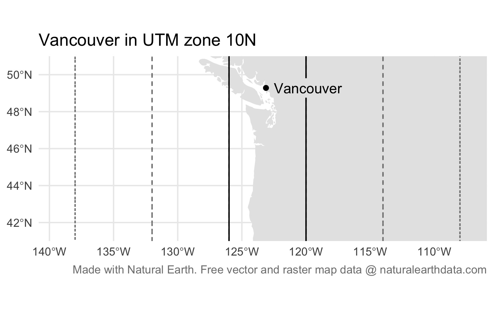

```{r setup, include=FALSE, message=FALSE, warning=FALSE}
library(learnr)
tutorial_options(exercise.timelimit = 120)
knitr::opts_chunk$set(echo = FALSE)

# Load packages
library(ggmap)
library(osmdata)
library(sf)
library(sfhotspot)
library(tidyverse)

# Copy files
if (!dir.exists("css")) dir.create("css")
walk(
  dir("../css/"), 
  ~ file.copy(str_glue("../css/{.}"), str_glue("css/{.}"), overwrite = TRUE)
)

# Load data --------------------------------------------------------------------

## Vancouver thefts ----
thefts <- janitor::clean_names(read_csv("https://github.com/mpjashby/crimemapping/raw/main/inst/extdata/vancouver_thefts.csv.gz"))
thefts_sf <- st_as_sf(thefts, coords = c("x", "y"), crs = 32610, remove = FALSE)
bike_thefts <- filter(thefts_sf, type == "Theft of Bicycle")
nbhds <- st_read("https://opendata.vancouver.ca/explore/dataset/local-area-boundary/download/?format=geojson")

## Nottingham areas ----
districts <- read_sf("https://github.com/mpjashby/crimemapping/raw/main/inst/extdata/nottinghamshire_districts.gpkg")
nottingham_boundary <- districts %>% 
  filter(district_name == "Nottingham") %>% 
  st_transform(27700)
wards <- read_sf("https://github.com/mpjashby/crimemapping/raw/main/inst/extdata/nottingham_wards.gpkg") %>% 
  filter(ward_name %in% c("Castle", "Lenton & Wollaton East", "Meadows"))

## Nottingham weapons offences ----
weapons <- read_sf("https://github.com/mpjashby/crimemapping/raw/main/inst/extdata/nottingham_weapons.gpkg") %>% 
  st_transform(27700)
weapons_kde <- hotspot_kde(weapons, cell_size = 100, bandwidth = 1000)

## Nottingham robberies
robbery <- read_csv("https://github.com/mpjashby/crimemapping/raw/main/inst/extdata/nottingham_robberies.csv.gz") %>% 
  st_as_sf(coords = c("longitude", "latitude"), crs = 4326) %>% 
  st_transform(27700)
robbery_gistar <- hotspot_gistar(robbery, cell_size = 100)
robbery_hotspot_categories <- hotspot_classify(
  robbery, 
  period = "28 days", 
  cell_size = 250
)

# Base map tiles for Nottingham
base_map_tiles <- robbery %>%
  st_transform(4326) %>%
  st_bbox() %>%
  set_names(c("left", "bottom", "right", "top")) %>% 
  get_stamenmap(zoom = 13, maptype = "toner-lite")
```


## What is a hotspot?

Crime is heavily concentrated in several different ways. A small number of 
offenders commit a large proportion of crime (even though most people commit 
offences occasionally) and a small number of people are repeatedly victimised.
For most types of crime, a large proportion of crime occurs in a small number of
places. **A hotspot is a specific location or small area where an unusual amount 
of criminal activity occurs**.

Crime hotspots can occur in several different forms. Watch this video to 
understand why hotspots are important in understanding and responding to crime.


When analysing hotspots, it is best to focus on *small* areas such as an
apartment block, a shopping centre, a park or a single street. Focusing on 
smaller areas is important because resources to respond to crime are almost 
always limited, so it is important that those resources are directed where the
problem is worst. Analysing larger areas, such as a neighbourhood or a police 
sector, is much more difficult because larger areas are always made up of many
smaller areas, each of which might be quite different from one another. This 
means that the factors causing one street to be a hotspot might be quite 
different from the factors that make another street in the same district into a
hotspot. Conflating different problems with different causes makes it much
harder to find effective ways to reduce crime in any one place. This can be 
avoided by keeping hotspots small: in an urban area, a useful rule of thumb is
that you should be able to stand in the middle of a hotspot and see the whole
hotspot area.

Being able to identify hotspots using crime mapping is important because it 
forms a vital first step in many place-focused responses to crime. As an example
of this, watch this video about how police in Philadelphia worked with 
researchers to use crime mapping to identify where to deploy foot patrols to
reduce crime.


## Handling spatial data

Before we can produce hotspot maps, we need to learn how to handle spatial data
in R. Spatial data is special because each row in the data is associated with 
some geographic feature such as a building, a street or a county. This adds some 
quirks that we have to understand to work with spatial data successfully.


### Vectors and rasters

Spatial data can be represented in two general formats: vectors and rasters. 
Watch this video from the UK mapping agency Ordnance Survey to find out more
about the advantages and disadvantages of using each type of data.


As you saw in the video, in general vector data gives you more control over the
appearance of a map, but at the cost of your having to put together each part of
the data yourself, choose the styles etc. In contrast, raster data (such as the
base map of Atlanta we used in the first map we made for this course) gives you
less control but allows you to add pre-formatted data to your map quickly.


### Spatial layers

Maps are made up of multiple layers of spatial data that are styled to represent
features of interest and then stacked on top of one another to make the finished
map. Watch this video to learn more about spatial layers and the three different
types of vector data that we can use in maps.


Points, lines and polygons in spatial data are known as *geometric objects* or
simply *geometries*. Spatial data is data that has a geometric object associated
with each row.


### Representing places on the earth

Since maps are two-dimensional representations of the curved surface of the 
earth, map-makers must make choices about how to translate that curved surface 
onto a flat screen or piece of paper. This video introduces these choices, and 
explains why they are relevant to crime mapping.


With any spatial data, we need a way of describing where on the earth a 
particular point (such as the location of a crime or the corner of a building)
is located. Watch this video to find out about the different co-ordinate 
systems we can use to do this.


## Spatial data in R

<p class="full-width-image"></p>

There are several packages that handle raster map data from different sources – 
one of them is the [`ggmap` package](https://github.com/dkahle/ggmap) that we 
have already used to load the base map of Atlanta for the homicide map we made 
in one of the earlier tutorials.

<a href="https://r-spatial.github.io/sf/" title="sf website"></a>

Vector data can be handled in R using functions from the 
[`sf` package](https://r-spatial.github.io/sf/). SF stands for 'simple 
features', which is a standard for storing spatial data. SF objects are data
frames that have a special column to hold the geometry (point, line or 
polygon) associated with each row in the data. SF objects also understand what
co-ordinate system the geometry are described in. This means SF objects can be
transformed between co-ordinate systems and combined together in layers on a 
map.

There a lots of functions in the `sf` package for handling spatial data. Almost
all of these functions begin with the letters `st_` (e.g. `st_read()`), which
makes it easy to identify that those functions are designed to be used on SF
objects.


### Reading spatial data

The special features of spatial data -- needing to store geometries, details of
the projection used etc. -- mean that spatial data is often stored in special
file formats. There are lots of spatial-data formats, but fortunately almost all
of them can be read by the `st_read()` function. This means we do not need to 
learn a different function for each spatial-data format.

While datasets with line or polygon geometries must almost always be stored in
specific spatial-data formats, point data can also be stored in common data
formats such as Excel and <abbr title="comma-separated values">CSV</abbr> files. 
The [data for this tutorial](https://geodash.vpd.ca/opendata/)  is provided by 
the Vancouver Police Department in a CSV file (gzipped to reduce the file size). 
The file is located at:

```r
https://github.com/mpjashby/crimemapping/raw/main/inst/extdata/vancouver_thefts.csv.gz
```

Thinking back to the tutorial on data wrangling, what R code is needed to load
this data into a tibble called `thefts`? Type the R code into the box below and 
click `Run Code` to see the result. If you need help, click the `Solution`
button, but try to remember the code (or look up your notes from the 
data-wrangling tutorial) before revealing the solution -- you'll learn a lot
more that way. Remember to load any necessary packages using the `library()`
function!

```{r read-exercise1, exercise=TRUE}

```

```{r read-exercise1-solution}
# Since the data are stored in a regular CSV file, we can use the `read_csv()`
# function from the readr package to read the file, and the assignment operator
# `<-` to store the data in the object `thefts`. `read_csv()` can read directly
# from a URL, so there is no need to download the data first.
library(tidyverse)

thefts <- read_csv("https://github.com/mpjashby/crimemapping/raw/main/inst/extdata/vancouver_thefts.csv.gz")
```

Now that you have stored the data in the `thefts` object, what code is needed
to view the first few rows of data? Type the code into the box and click 
`Run Code` to check the result.

```{r read-exercise2, exercise=TRUE, exercise.setup="read-exercise1-solution"}

```

```{r read-exercise2-solution}
head(thefts)
```

The data consists of `r scales::comma(nrow(thefts))` rows, each representing one
theft. Before we can map this data, we will need to do some minor data wrangling
to get it into the format we want.


### Cleaning column names

<p class="full-width-image"></p>

In a previous tutorial we recommended choosing `snake_case` object names, e.g.
calling a data object `atlanta_robberies_2020` rather than 
`atlantarobberies2020`, `AtlantaRobberies2020` or `ATLANTAROBBERIES2020`. This 
makes your code easier to read and means you don't have to remember whether you 
named a variable using upper- or lower-case letters, since you know that you 
only use lower case. 

The same recommendation applies to variable names in datasets, for the same 
reasons. Doing this makes it much easier to refer to objects and columns in your 
code, without having to worry about whether a particular letter was upper- or 
lower-case, or whether it had an accent etc. 

<a href="http://sfirke.github.io/janitor/" title="janitor package website">
</a>

At the moment, the column names in the `thefts` dataset are upper-case letters. 
Rather than having to remember this, we can easily convert them to snake case 
using the `clean_names()` function from the [`janitor` package](http://sfirke.github.io/janitor/).
To use a function from a package, we usually first load the package using the
`library()` function. In this case, we probably won't want to use any other
functions from the `janitor` package, so instead of loading the whole package we
will use this one function directly. To do this, we write the function name with
the package name added to the front, separated by two colons `::`.

```{r read-exercise3, exercise=TRUE, exercise.setup="read-exercise1-solution"}
thefts <- janitor::clean_names(thefts)

head(thefts)
```

You can see that the data has stayed the same but all the column names are now
in snake case. `clean_names()` would also have replaced any spaces with 
underscores, tries to separate words in the variable names and cleaned up 
several other potential problems with variable names. For this reason it is 
common to call `janitor::clean_names()` straight away after loading a dataset so
that you can be confident that the column names will be in the format you 
expect.

If we wanted to use the `clean_names()` function again, we would have to include
the package name and `::` each time, so if our code was going to make repeated
use of the function then it would probably be easier to load the package as
we have done in previous tutorials.


### Converting our data to an SF object

At present, the data in the `thefts` object is just a regular tibble. We could
not use it to make a map because R does not know which columns represent the
geometry, or what co-ordinate system the locations are recorded in. We can deal
with this by converting the data to an SF object using the `st_as_sf()` function
from the `sf` package.

The data provided by the Vancouver Police use the UTM zone 10N co-ordinate
system. <abbr title="Universal Transverse Mercator">UTM</abbr> is a system for
assigning co-ordinates to any location on earth relative to a local origin point
for the UTM zone covering that part of the planet. It is therefore similar to
the British National Grid that we have already learned about, but for any part
of the globe. The 'N' at the end of the zone name refers to the northern
hemisphere.

```{r utm-map-data, cache=TRUE, include=FALSE, message=FALSE, warning=FALSE}
if (!file.exists("images/utm_vancouver.jpg")) {
  
  vancouver <- st_point(c(-123.1207, 49.2827), dim = "XY") %>% 
    st_sfc(crs = 4326) %>% 
    st_as_sf() %>% 
    mutate(name = "Vancouver")
  
  land <- suppressMessages(rnaturalearth::ne_download(
    scale = 50, type = "land", category = "physical", returnclass = "sf"
  )) %>% 
    filter(scalerank == 0)
  
  utm_zones <- st_read("https://opendata.arcgis.com/datasets/b294795270aa4fb3bd25286bf09edc51_0.geojson") %>% 
    janitor::clean_names() %>% 
    mutate(
      hemisphere = ifelse(row %in% LETTERS[1:13], "southern", "northern")
    ) %>% 
    select(zone, hemisphere, geometry) %>% 
    group_by(zone, hemisphere) %>% 
    summarise()

}
```

```{r utm-map, cache=TRUE, message=FALSE, warning=FALSE, fig.align="center", out.width="80%"}
if (!file.exists("images/utm_vancouver.jpg")) {

  bbox <- utm_zones %>% 
    filter(zone %in% 8:12, hemisphere == "northern") %>% 
    st_buffer(1) %>% 
    st_bbox()
  
  utm_centroids <- utm_zones %>% 
    st_centroid() %>% 
    mutate(
      zone_label = str_glue("zone {zone}{str_to_upper(str_sub(hemisphere, 1, 1))}")
    ) %>% 
    st_crop(bbox)
  
  utm_vancouver <- ggplot() +
    geom_sf(data = st_crop(land, bbox), colour = NA) +
    geom_sf(
      data = st_crop(st_cast(utm_zones, "LINESTRING"), bbox), 
      colour = "grey50", 
      fill = NA, 
      linetype = "24"
    ) +
    geom_sf(
      data = st_crop(filter(utm_zones, zone == 10, hemisphere == "northern"), bbox),
      colour = "black", 
      fill = NA
    ) +
    geom_sf(data = vancouver) +
    geom_sf_text(aes(label = zone_label), data = utm_centroids) +
    geom_sf_label(
      aes(label = name), 
      data = vancouver, 
      fill = "grey90", 
      hjust = 0, 
      nudge_x = 0.3, 
      label.size = 0
    ) +
    scale_x_continuous(expand = c(0, 0)) +
    scale_y_continuous(limits = c(41, 51), expand = c(0, 0)) +
    labs(
      title = "Vancouver in UTM zone 10N", 
      x = NULL, 
      y = NULL,
      caption = "Made with Natural Earth. Free vector and raster map data @ naturalearthdata.com"
    ) +
    theme_minimal() +
    theme(plot.caption = element_text(colour = "grey50"))
  
  ggsave(
    "images/utm_vancouver.jpg", 
    utm_vancouver, 
    units = "px",
    width = 1600, 
    height = 1000
  )
  
} else {
  
  
  
}
```

We can convert the `thefts` tibble to an SF object using the `st_as_sf()`
function (remember, all functions in the `sf` package start with `st_`, which
can sometimes make the function names a little confusing). We specify which
columns in the data represent the geometry (in this case, the `x` and `y`
columns), and what co-ordinate system the data uses. 

Co-ordinate systems can be specified in lots of ways (some very complicated),
but the easiest is to specify the <abbr title="European Petroleum Survey
Group">EPSG</abbr> code for the relevant system. An EPSG code is a unique
reference number for a particular co-ordinate system that R can look up in a
database to get the information needed to display the data on a map. The EPSG
code for the UTM zone 10N is `32610`.

```{r convert-exercise1, exercise=TRUE}
library(sf)

thefts_sf <- st_as_sf(thefts, coords = c("x", "y"), crs = 32610, remove = FALSE)

thefts_sf
```

If you look at the contents of the `thefts_sf` object, you'll see that there is
a new column called `geometry` (you may need to use the ▸ button to see it). 
This column contains the co-ordinates of each bike theft in a format that R 
recognises represent locations on the surface of the earth, which means they can
be used to make maps.


<div class="box extra-detail">

<h5 id="convert-box1-title" class="box-title">Why did we use the `remove = FALSE` argument?</h5>

<div id="convert-box1" class="box-content">

We need to specify `remove = FALSE` because by-default the `st_as_sf()` function
removes the data columns containing map co-ordinates once it has converted them
into a geometric object stored in the geometry column. This is useful for making
very-large datasets smaller (by removing redundant columns), but in this case we
will need the `x` and `y` columns later, so we want to keep them in the dataset.

</div>

</div>

<script>
$("#convert-box1-title").click(function () { $("#section-convert-box1").toggle("slow") })
</script>


### Finding bike thefts in our data

If you look through the contents of the `thefts_sf` object, you will see that 
not all of the rows relate to bicycle thefts. The `type` column shows that the
dataset also includes thefts from vehicles, for example. To choose only those 
rows containing bicycle thefts, which function from the `dplyr` package
would we used? If you need help, you can think back to the data-wrangling 
tutorial or have a look at the [Data transformation with dplyr cheat sheet](https://github.com/rstudio/cheatsheets/raw/master/data-transformation.pdf).

```{r filter-quiz}
question(
  "Which function from the `dplyr` package should we use to remove all the rows from our dataset except those for bicycle thefts?",
  answer("`filter()`", correct = TRUE),
  answer("`select()`", message = "Nearly right. The `select()` function allows us to choose particular *columns* from our dataset -- in this case, we want to choose particular *rows*."),
  answer("`mutate()`", message = "Not quite. The `mutate()` function allows us to change the values in existing columns in our dataset, or add new columns."),
  answer("`summarise()`", message = "Not quite. The `summarsise()` function allows us to create summaries of the values of columns, either for the whole dataset or groups of rows."),
  correct = random_praise(),
  incorrect = random_encouragement(),
  allow_retry = TRUE,
  random_answer_order = TRUE
)
```

Type the code needed to choose only the rows of data that relate to bicycle
thefts and store it in a new object called `bike_thefts`. Click the `Run Code` 
button to see the results of your code. If you get stuck, you can click the 
`Hint` buttons to get help, but try to find the answer on your own first!

```{r filter-exercise1, exercise = TRUE}

```

```{r filter-exercise1-hint-1}
# Use the `filter()` function to choose particular rows in a dataset. The syntax 
# for `filter()` is `filter(dataset, column_name == "value")`
```

```{r filter-exercise1-hint-2}
# In the code `filter(dataset, column_name == "value")`, replace `dataset` with
# the name of the SF object you have already created from the `thefts` tibble,
# `column_name` with the name of the column containing the offence type and
# `value` with the offence type for bicycle theft.
```

```{r filter-exercise1-hint-3}
# The correct code to store only bicycle thefts in a new object is:
bike_thefts <- filter(thefts_sf, type == "Theft of Bicycle")
```

Our data is now ready for us to make our crime map!

<p class="credits">
[Stats Illustrations by Allison Horst](https://github.com/allisonhorst/stats-illustrations) licensed under the [Creative Commons Attribution licence](https://github.com/allisonhorst/stats-illustrations/blob/master/license).
</p>


## Density maps

In previous tutorials we have seen how we can use functions from the `ggplot2`
package to make maps and other visualisations.

Unless we want to produce a map of only a very small number of crimes (like the
Atlanta downtown homicides map we produced in a previous tutorial), it is 
unlikely that a map showing individual crimes as points will be very useful. 

<div class="box notewell">

**If you find yourself making map with each crime represented by a 
separate point, you should probably stop and ask yourself if that is really the 
best way to achieve your goal**. Alternatives such as density maps are almost
always a better choice.

</div>

A better way to show where crime is concentrated on a map is to work out the
*density* of crime in each area and then map that density. By *density* in this
context we mean the relative concentration of points in each part of the area we
are studying, i.e. how many points (representing bike thefts) are there in each
part of the map relative to all the other areas of the map.

<a href="https://github.com/mpjashby/sfhotspot/" title="sfhotspot website">
</a>

Behind the scenes, the process of kernel density estimation involves:

  1. If the data uses a geographic co-ordinate system (i.e. one where locations
     are expressed using latitude and longitude), transforming the data to use a
     projected co-ordinate system so that we can specify distances in units such
     as metres or feet rather than decimal degrees.
  2. Creating a grid of cells covering the area we are interested in.
  3. For each cell, identifying all the other crimes within a certain distance
     (called the *bandwidth*).
  4. Counting all the crimes within the bandwidth, but *weight* that count so 
     that closer crimes are weighted more highly and crimes that are further 
     away are weighted less highly.
  5. Totalling up the weighted count for all the crimes in each cell.
  6. Displaying the total for each cell on the map.
  
To do this, we will use the `hotspot_kde()` function from the `sfhotspot` 
package to create an SF object containing a grid of cells with the density of
crimes in each cell.

To demonstrate this process, lets create a density map of possession of weapons 
offences in Nottingham in 2020. The data for this are available at
`https://github.com/mpjashby/crimemapping/raw/main/inst/extdata/nottingham_weapons.gpkg`
and can be loaded directly using `read_sf()` because they are already stored in 
a spatial format (a geopackage file). The data in this file uses latitude and 
longitude to store locations, so we will transform it to a projected co-ordinate 
reference system (i.e. one based on metres) to make the KDE process easier. 
Since the data are for an area of Great Britain we will use the British National 
Grid, for which the EPSG code is `27700`. Run the code needed to load the data 
into an object called `weapons`, then transform the co-ordinates to the British 
National Grid and display the first few rows.

```{r density-exercise1, exercise=TRUE, exercise.lines=5}

```

```{r density-exercise1-solution}
weapons <- read_sf("https://github.com/mpjashby/crimemapping/raw/main/inst/extdata/nottingham_weapons.gpkg") %>% 
  st_transform(27700)

head(weapons)
```

By default, `hotspot_kde()` will choose reasonable default values for all the
possible ways we could fine-tune density estimation process. This means we can
produce a KDE map very simply by passing the object produced by `hotspot_kde()`
onto `ggplot()`.

```{r density-exercise2, exercise=TRUE, fig.asp=1, out.width="100%"}
library(sfhotspot)

weapons_kde <- hotspot_kde(weapons)

ggplot(weapons_kde) + 
  geom_sf(aes(colour = kde, fill = kde)) +
  scale_colour_distiller(aesthetics = c("colour", "fill")) + 
  theme_void()
```


<div class="box extra-detail">

<h5 id="density-box1-title" class="box-title">What does the argument `aesthetics = c("colour", "fill")` mean?</h5>

<div id="density-box1" class="box-content">

The object produced by `hotspot_kde()` consists of thousands of grid cells. Each
cell is a square polygon, meaning we can specify both the colour of the border
around each cell (using the `colour` aesthetic) and the colour of the inside of
the cell (using the `fill` aesthetic). 

In a KDE map, we almost always want the `colour` and `fill` aesthetics to be set
to the same colour because each grid cell is so small that having a different
colour for the cell borders would make the map look very cluttered. This is why
we specify that _both_ the `colour` and `fill` aesthetics should be controlled
by the values in the `kde` column in the data, by using the code
`geom_sf(aes(colour = kde, fill = kde))`.

Because the `kde` column is controlling two aesthetics (`colour` and `fill`), if 
we want to change the colour scheme using a `scale_` function we have to do this 
for both `colour` and `fill`. We could do this like this:

```r
ggplot(weapons_kde) + 
  geom_sf(aes(colour = kde, fill = kde)) +
  scale_colour_distiller() +
  scale_fill_distiller()
```

But rather than duplicate the arguments inside both `scale_` functions (and then
have to make sure we remember to make any changes inside both functions), we can
save ourselves a line of code by specifying one scale and then making it apply 
to both aesthetics:

```r
ggplot(weapons_kde) + 
  geom_sf(aes(colour = kde, fill = kde)) +
  scale_colour_distiller(aesthetics = c("colour", "fill"))
```


</div>

</div>

<script>
$("#density-box1-title").click(function () { $("#section-density-box1").toggle("slow") })
</script>


You might have noticed that `hotspot_kde()` has produced two messages, one 
saying that the cell size has been set automatically and another saying the
bandwidth has been set automatically using a rule of thumb. Since the `weapons`
object uses a projected co-ordinate system measured in metres, both these values
are set in metres as well. 

We can control the appearance of the density surface on our map by
varying the number of cells in the grid and the definition of what cells the
kernel density estimation process should consider to be 'nearby' for the 
purposes of calculating weighted counts. Cells are considered to be 'nearby' to
a particular cell if they are closer to that cell than a distance known as the
KDE *bandwidth*.

By default, `hotspot_kde()` creates a grid of cells that covers all of the input
data and has 50 cells on the shorter side of the grid (adjusted so that the size
of each cell is a round number of hundreds of metres). `hotspot_kde()` will also
set the size of the bandwidth based on an established rule of thumb (which we
don't need to go into the details of). The maps below show how changing these 
defaults changes the appearance of our map (with the legend and axes removed to 
make the small maps clearer).

```{r kde-bandwidth, fig.align="center", fig.asp=1.5, out.width="100%"}
tibble(
  n = rep(c(10, 100, 200), 5), 
  bw = rep(c(4, 2, 1, 0.5, 0.25), each = 3)
) %>% 
  pmap(function (...) {
    current <- tibble(...)
    ggplot() +
      geom_density_2d_filled(
        aes(x = x, y = y), 
        data = bike_thefts, 
        n = current$n, 
        adjust = current$bw
      ) +
      coord_sf(crs = 32610) +
      labs(
        subtitle = str_glue(
          "{current$n/100}x default grid\n{current$bw}x default bandwidth"
        )
      ) +
      theme_void() +
      theme(
        # axis.text = element_blank(),
        # axis.ticks = element_blank(),
        # axis.title = element_blank(),
        legend.position = "none",
        # panel.background = element_blank(),
        # panel.grid = element_blank(),
        plot.subtitle = element_text(size = 8)
      )
  }) %>% 
  cowplot::plot_grid(plotlist = ., ncol = 3)
```

By looking at the maps in the top two rows, you can see that reducing the
number of grid cells leads to a map that looks blocky, but that increasing the 
number of grid cells above the default doesn't make much difference (it might do 
if we needed to make a very large map).

Looking at the middle column of maps, you can see that increasing the bandwidth
relative to the default makes the density surface smoother. The smoother the 
surface, the less detail we can see about where crime is most concentrated, 
until on the top row we can see almost no information at all. On the other
hand, if we reduce the bandwidth too much (the bottom row of maps) then almost
no 'nearby' cells are included in the count and so it becomes more difficult to
identify patterns.

Going back to our map of weapons possession in Nottingham, it doesn't look like
the default settings have produced the optimum KDE map. In particular, it looks
like the automatically chosen bandwidth might be too large, since the resulting
map lacks sufficient detail to be used to make decisions (the areas of high
density look like oval blobs). By default, the colour palette created by
`scale_colour_distiller()` also shows the areas of _lowest_ density of weapons
possession offences with the colour that has the _highest_ saturation.

To fix these issues, we can produce another map but specify the bandwidth
ourselves. To do this we can look at the message produced by `hotspot_kde()`
stating what bandwidth was chosen automatically, then use that as the starting
point in choosing our own bandwidth. So if the automatically chosen bandwidth
was 2,247 metres, we might choose 1,000 metres as a potentially useful bandwidth
and then try that out to see what the resulting map looks like. To do this, we
set the `bandwidth` argument to `hotspot_kde()`. At the same time we will: 

  * set the `cell_size` argument of `hotspot_kde()` to `100` to suppress the
    message telling us what value was chosen automatically, and
  * add the `direction = 1` argument to `scale_colour_distiller()` so that the 
    cells with the highest density are represented by the most vibrant colour.

```{r density-exercise3, exercise=TRUE, fig.asp=1, out.width="100%"}
# Both `cell_size` and `bandwidth` are specified in metres, since the `weapons`
# dataset uses a CRS that is specified in metres
weapons_kde <- hotspot_kde(weapons, cell_size = 100, bandwidth = 1000)

ggplot(weapons_kde) + 
  geom_sf(aes(colour = kde, fill = kde)) +
  scale_colour_distiller(direction = 1, aesthetics = c("colour", "fill")) + 
  theme_void()
```

<!--
From this map we can see several things. The first is that the grid created by
`create_rectangular_grid()` has not produced a grid covering the bounding box of
the `weapons` layer, which is what `geom_density_2d_filled()` would have done.
Instead, the grid only covers what is referred to by geographers as the *convex
hull* of the data. This is the smallest shape that contains all the points in 
the data: if the crimes were represented by pins stuck into a board, the convex
hull would be the shape made by an elastic band stretched around the outermost
pins. This reduces (but doesn't eliminate) the problem of calculating spurious
density estimates for areas that are not covered by the data.
-->


### Adding a legend of a KDE map

We can add a legend to our density map to help readers understand it more
easily. We can do this by adding two arguments to the `scale_colour_distiller()`
function:

  * `breaks`, which specifies which positions on the range of values we would
    like to label. It's usually best to label the highest and largest values,
    which we can determine automatically.
  * `labels`, which specifies the text of the labels on the legend.
  
To find the highest and lowest density values, we extract the `kde` column from 
the `weapons_kde` object using the `pull()` function and then use the `range()` 
function to calculate the values.

```{r density-exercise7-setup}
weapons_kde <- hotspot_kde(weapons, cell_size = 100, bandwidth = 1000)
```

```{r density-exercise7, exercise=TRUE, fig.asp=1, out.width="100%"}
ggplot(weapons_kde) +
  geom_sf(aes(colour = kde, fill = kde)) +
  scale_colour_distiller(
    breaks = range(pull(weapons_kde, kde)),
    labels = c("lower", "higher"),
    direction = 1, 
    aesthetics = c("colour", "fill")
  ) +
  theme_void()
```


## Clipping a KDE layer

The KDE layer we have created using the functions in the `sfhotspot` package is
based on the bounding box of the crime data. This means there will be many cells 
in our KDE layer that represent areas not covered by our dataset. We can see 
this by plotting the boundary of the City of Nottingham over our new KDE layer, 
which also shows there are some parts of the city that are outside our KDE grid 
because no weapons-possession offences were recorded there (they are mostly 
fields or rivers).

```{r overlay-map, include=FALSE, message=FALSE, warning=FALSE}
if (!file.exists("images/nottingham_weapons_overlay.jpg")) {
  
  weapons_kde <- hotspot_kde(weapons, cell_size = 100, bandwidth = 1000)
  
  overlay_map <- ggplot() +
    geom_sf(aes(colour = kde, fill = kde), data = weapons_kde) +
    geom_sf(data = filter(districts, district_name == "Nottingham"), fill = NA) +
    scale_colour_distiller(
      breaks = range(pull(weapons_kde, kde)),
      labels = c("lower", "higher"),
      direction = 1, 
      aesthetics = c("colour", "fill")
    ) +
    theme_void()
  
  ggsave(
    "images/nottingham_weapons_overlay.jpg",
    overlay_map,
    width = 1200 / 150,
    height = 900 / 150,
    dpi = 300
  )
  
}
```

<p class="full-width-image"></p>

Showing density values for places for which we do not actually have data might
be misleading. For example, consider this map of recorded weapons-possession
offences in part of Nottingham, England.

```{r notts-damage-map, include=FALSE, message=FALSE, warning=FALSE}
if (
  !file.exists("images/example_nottingham_weapons.jpg") |
  !file.exists("images/example_nottinghamshire_weapons.jpg")
) {
  
  city_damage <- read_sf("../../extdata/nottingham_weapons.gpkg")
  county_damage <- read_sf("../../extdata/nottinghamshire_weapons.gpkg")
  
  map_crop <- districts %>% 
    filter(district_name == "Nottingham") %>% 
    st_bbox() %>% 
    set_names(c("left", "bottom", "right", "top")) %>% 
    {
      .[["top"]] <- 52.96
      .
    }
  
  districts_crop <- districts %>% 
    filter(
      district_name %in% c("Broxtowe", "Nottingham", "Rushcliffe")
    ) %>% 
    st_crop(map_crop)
  
  points <- tribble(
    ~longitude, ~latitude, ~label,
    -1.150, 52.950, "A", # City Centre
    # -1.182, 52.903, "B", # Clifton
    -1.210, 52.929, "B" # Beeston
    # -1.130, 52.930, "D"  # West Bridgeford
  ) %>% 
    st_as_sf(coords = c("longitude", "latitude"), crs = 4326)
  
  city_map <- map_crop %>% 
    get_stamenmap(zoom = 13, maptype = "toner-background") %>% 
    ggmap() +
    geom_density2d_filled(
      aes(longitude, latitude), 
      data = city_damage, 
      na.rm = TRUE,
      bins = 9, 
      n = 300,
      adjust = 0.5,
      alpha = 0.85
    ) +
    geom_sf_label(
      aes(label = label), 
      data = points, 
      inherit.aes = FALSE, 
      label.r = unit(0.5, "lines"),
      label.size = NA, 
      colour = "white",
      fill = "black",
      fontface = "bold", 
      size = 4
    ) +
    scale_fill_brewer(
      labels = c("low", rep("", 7), "high"),
      guide = guide_legend(reverse = TRUE)
    ) +
    labs(
      title = "Weapons possession offences in south Nottingham",
      caption = "Contains public sector information licensed under the Open Government Licence v3.0",
      fill = "density of offences, 2020"
    ) +
    theme_void() +
    theme(
      legend.background = element_rect(colour = NA, fill = rgb(1, 1, 1, 0.75)),
      legend.justification = c(1, 0),
      legend.key.height = unit(0.75, "lines"),
      legend.margin = margin(6, 6, 6, 6),
      legend.position = c(0.98, 0.02),
      plot.caption = element_text(colour = "grey40"),
      plot.title = element_text(
        colour = "grey50", 
        face = "bold", 
        size = 16, 
        margin = margin(b = 9)
      )
    )
  
  county_map <- map_crop %>% 
    get_stamenmap(zoom = 13, maptype = "toner-background") %>% 
    ggmap() +
    geom_density2d_filled(
      aes(longitude, latitude), 
      data = county_damage, 
      na.rm = TRUE,
      bins = 9, 
      n = 300,
      adjust = 0.5,
      alpha = 0.85
    ) +
    geom_sf(data = districts, inherit.aes = FALSE, fill = NA) +
    geom_sf_text(
      aes(label = str_to_upper(district_name)),
      data = districts_crop,
      inherit.aes = FALSE,
      colour = "grey66",
      fontface = "bold",
      lineheight = 1
    ) +
    geom_sf_label(
      aes(label = label), 
      data = points, 
      inherit.aes = FALSE, 
      label.r = unit(0.5, "lines"),
      label.size = NA, 
      colour = "white",
      fill = "black",
      fontface = "bold", 
      size = 4
    ) +
    scale_fill_brewer(
      labels = c("low", rep("", 7), "high"),
      guide = guide_legend(reverse = TRUE)
    ) +
    labs(
      title = "Weapons possession offences in south Nottingham",
      caption = "Contains public sector information licensed under the Open Government Licence v3.0",
      fill = "density of offences, 2020"
    ) +
    theme_void() +
    theme(
      legend.background = element_rect(colour = NA, fill = rgb(1, 1, 1, 0.75)),
      legend.justification = c(1, 0),
      legend.key.height = unit(0.75, "lines"),
      legend.margin = margin(6, 6, 6, 6),
      legend.position = c(0.98, 0.02),
      plot.caption = element_text(colour = "grey40"),
      plot.title = element_text(
        colour = "grey50", 
        face = "bold", 
        size = 16, 
        margin = margin(b = 9)
      )
    )
  
  ggsave(
    "images/example_nottingham_weapons.jpg",
    city_map,
    width = 1200 / 150,
    height = 900 / 150,
    dpi = 300
  )
  
  ggsave(
    "images/example_nottinghamshire_weapons.jpg",
    county_map,
    width = 1200 / 150,
    height = 900 / 150,
    dpi = 300
  )
  
}
```

<p class="full-width-image"></p>

If we were thinking about where recorded weapons-possession offences concentrate
in and around Nottingham based on the map above, we would probably give very low
priority to area B, since there does not appear to be any concentration there.
But the absence of crime there is actually solely an artefact of us not having
data for those areas. The boundary of the City of Nottingham administrative
district is quite a lot smaller than the urban area of Nottingham, so if we only
have data for the City of Nottingham then it will inaccurately appear that
places that are on the map but not covered by the data have no crime. If we look
at a map that includes data for the surrounding districts as well, we can see
that area B actually has a higher density of offences than it previously
appeared.

<p class="full-width-image"></p>

We can deal with this problem by clipping the KDE layer to the City of 
Nottingham boundary to make it clear the areas for which we don't have data. 
Since `hotspot_kde()` produces an SF object, this is easy to do using the 
`st_intersection()` function from the `sf` package.

To clip the KDE layer to the city boundary, we first need to load the boundary.
In this case, we will load a dataset containing all the district boundaries in
Nottinghamshire and then filter it to keep only the city boundary. Since 
`st_intersection()` produces an error if used with datasets that use different
co-ordinate systems, we will also transform the boundary so that it represents 
co-ordinates using the British National Grid.

```{r kde-exercise8, exercise=TRUE}
nottingham_boundary <- read_sf("https://github.com/mpjashby/crimemapping/raw/main/inst/extdata/nottinghamshire_districts.gpkg") %>% 
  filter(district_name == "Nottingham") %>% 
  st_transform(27700)
```

We can now create a clipped KDE layer using `st_intersection()`, which acts as a
spatial filter, keeping only the elements of the first object passed to the 
function that are located within the polygon that is given as the second 
argument. In this case, it will produce an object containing the KDE values for
only those cells in our grid that are within the city boundary.

```{r kde-exercise9, exercise=TRUE, exercise.setup="density-exercise7-setup", exercise.timelimit=300, fig.asp=1}
weapons_kde_clipped <- st_intersection(weapons_kde, nottingham_boundary)
```


<div class="box notewell">

`st_intersection()` can take a minute or two to run and (depending on the speed 
of your computer) may not finish before the time limit set for running code 
within this tutorial expires. If you see an error saying 
`Your code ran longer than the permitted timelimit for this exercise` or 
`reached elapsed time limit`, you can continue with the rest of the tutorial as
usual.

</div>


We can plot the clipped KDE layer on a basic map and overlay it with the 
boundary of the City of Nottingham, which shows that `weapons_kde_clipped` now
only contains grid cells that are inside the city boundary.

```{r clipped-map, include=FALSE, message=FALSE, warning=FALSE}
if (!file.exists("images/nottingham_weapons_clipped.jpg")) {
  
  weapons_kde_clipped <- st_intersection(weapons_kde, nottingham_boundary)
  
  clipped_map <- ggplot() +
    geom_sf(aes(colour = kde, fill = kde), data = weapons_kde_clipped) +
    geom_sf(data = nottingham_boundary, fill = NA) +
    scale_colour_distiller(direction = 1, aesthetics = c("colour", "fill")) +
    theme_void()
  
  ggsave(
    "images/nottingham_weapons_clipped.jpg", 
    clipped_map,
    width = 1200 / 150,
    height = 900 / 150,
    dpi = 300
  )
  
}
```

<p class="full-width-image"></p>


<!--
## Showing the density of risk

In the tutorial on mapping area data we learned how to produce maps showing the
*incidence rate* of crime by dividing the number of crimes by a measure of the
population at risk of being targeted. We will often only have population 
estimates for areas, such as census estimates of the number of people living in
an area. But for some crimes we have access to estimates of the people (or,
more often, objects) at risk of being a target of a particular crime. In these
cases, we can produce better maps of the risk of crime in different areas by
producing a *dual KDE* map that shows the density of crime *risk* in different
places.

To create a dual KDE map, we estimate the density of crime as in the previous
section, then estimate the density of the population at risk using the same
technique. Since the incidence rate is calculated as the number of crimes 
divided by the number of people or objects at risk, we can calculate the density
of risk by dividing the density of crime estimated for each cell in the grid by
the density of population estimated for the same cell.

To illustrate this, we will use reports of burglaries in three wards in Nottingham in 
2020. Since the essential element of the crime of burglary is that an offender 
enters a building as a trespasser in order to steal something, the best measure 
of the population at risk of burglary is the number of *buildings* in each area. 
This is an example of why the routine activities approach to thinking about 
crime that we introduced in a previous tutorial emphasises thinking about 
*targets* of crime rather than focusing exclusively on crime victims. In this 
case, one person might be the owner of a large number of buildings (e.g. a farm 
with lots of out-buildings) or lots of people might own a single building (such 
as a house converted into flats). By thinking about the targets that are 
attacked by offenders, we can identify that burglary rates should be calculated 
based on buildings rather than, for example, residential population. Note that 
if our crime data only included _residential_ burglaries then we would want to
use _residential_ buildings as our denominator, but in this case we have data
for all burglaries, both residential and non-residential.


### Data wrangling

Before we can create our KDE layers we have to complete some data wrangling. We
will extract the boundaries for the wards of interest from a dataset of 
boundaries for all wards in Nottingham using `filter()` as we have done 
previously. To extract only the burglaries occurring in those three wards from
a dataset of all burglaries in Nottingham, we will use `st_intersection()` as
we did in the previous section.

```{r risk-exercise1, exercise=TRUE, eval=FALSE}
wards <- read_sf("https://github.com/mpjashby/crimemapping/raw/main/inst/extdata/nottingham_wards.gpkg") %>% 
  filter(ward_name %in% c("Castle", "Lenton & Wollaton East", "Meadows"))

burglaries <- read_csv("https://github.com/mpjashby/crimemapping/raw/main/inst/extdata/nottingham_burglaries.csv.gz") %>% 
  st_as_sf(coords = c("longitude", "latitude"), crs = 4326) %>% 
  st_intersection(wards)
```


<div class="box notewell">

Remember that `st_intersection()` can take longer to run than the maximum time
limit for running code within this tutorial. If you see an error saying 
`Your code ran longer than the permitted time limit for this exercise` or 
`reached elapsed time limit`, you can continue with the rest of the tutorial as
usual.

</div>


We do not have a source of open data for all the buildings in Nottingham, so we
will use the `osmdata` package to get the locations of buildings from 
OpenStreetMap (OSM). Run the code needed to download data from OSM for all the
buildings in the three wards we are interested in and store it in an object 
called `nottingham_buildings`. The OSM feature key for a building is 'building' 
and it is not necessary to specify a value (since we want to capture all types 
of building). The `osmdata` package expects data to use the WGS84 co-ordinate 
reference system, so make sure any data sources you use are projected using that 
system (EPSG code 4326).

```{r risk-exercise2, exercise=TRUE, exercise.lines=10, eval=FALSE}

```

```{r risk-exercise2-hint-1, eval=FALSE}
# Remember to load the `osmdata` package
```

```{r risk-exercise2-hint-2, eval=FALSE}
# To download OSM data, use the `opq()` function to specify the bounding box of
# the area you want to download data for, the `add_osm_feature()` function to
# specify what type of features to download and the `osmdata_sf()` function to
# download the data as an SF object
```

```{r risk-exercise2-hint-3, eval=FALSE}
library(osmdata)

nottingham_buildings <- wards %>% 
  st_bbox() %>% 
  opq() %>% 
  add_osm_feature(key = "?????") %>% # <- specify type of data here
  osmdata_sf()

nottingham_buildings
```

```{r risk-exercise2-hint-4, eval=FALSE}
library(osmdata)

nottingham_buildings <- wards %>% 
  st_bbox() %>% 
  opq() %>% 
  add_osm_feature(key = "building") %>% 
  osmdata_sf()

nottingham_buildings
```

Looking at the `nottingham_buildings` object, we can see that OSM contains data
on buildings stored as points, polygons and multipolygons (we can ignore the
few linestrings tagged as buildings, since it doesn't make sense for a building
to be represented as a single line rather than a point or a polygon). 


<div class="box extra-detail">

<h5 id="risk-box1-title" class="box-title">What is a multipolygon?</h5>

<div id="risk-box1" class="box-content">

OpenStreetMap stores features in several different ways. The most basic types
are points, lines and polygons. But there are also multipolygons (and
multilines). These are features that represent complex structures such as 
clusters of buildings that are separate structures but are related to each 
other. For example, a hospital with several buildings might be represented in
OpenStreetMap as a single multipolygon feature.

</div>

</div>

<script>
$("#risk-box1-title").click(function () { $("#section-risk-box1").toggle("slow") })
</script>


Let's plot these features on a base map to check that OSM has reasonable 
coverage of the buildings in these three wards.

```{r risk-exercise3, exercise=TRUE, message=FALSE, exercise.lines=30, fig.asp=1, out.width="100%", eval=FALSE}
wards %>% 
  st_bbox() %>% 
  set_names(c("left", "bottom", "right", "top")) %>% 
  get_stamenmap(zoom = 13, maptype = "toner-lite") %>% 
  ggmap() + 
  # Add building features stored as points
  geom_sf(
    data = pluck(nottingham_buildings, "osm_points"), 
    inherit.aes = FALSE, 
    colour = "lightgreen",
    size = 0.1
  ) +
  # Add building features stored as polygons
  geom_sf(
    data = pluck(nottingham_buildings, "osm_polygons"), 
    inherit.aes = FALSE, 
    colour = NA,
    fill = "lightblue"
  ) + 
  # Add building features stored as multi-polygons
  geom_sf(
    data = pluck(nottingham_buildings, "osm_multipolygons"), 
    inherit.aes = FALSE, 
    colour = NA,
    fill = "pink"
  ) +
  # Add ward boundaries
  geom_sf(data = wards, inherit.aes = FALSE, colour = "purple", fill = NA) +
  theme_void()
```


<div class="box notewell">

Remember that `osmdata_sf()` gets OSM data for the area covered by the _bounding 
box_ of the input feature, not the feature boundaries. This means some of the
buildings returned by the code above will be outside the wards we are interested
in. We will deal with this in a minute.

</div>


It looks like almost all the streets in the three wards we are interested in are
lined with buildings in the OSM data, which is what we would expect of streets
in an urban area. There are some streets without buildings in the top-left of 
the map, but these streets are outside our three wards so this does not matter.

THE NEXT LINE SHOULD HAVE ` CHANGED TO ` r ONCE DUAL KDE IS RETURNED TO THE 
TUTORIAL

We can also see from this map that the `scales::comma(nrow(pluck(nottingham_buildings, "osm_points")))`
point features in the OSM data (shown as green dots on the map) typically 
represent the corners of buildings that are also represented as polygons, so we
know we can ignore the points layer within the OSM data.

Since the `hotspot_kde()` function works on points, we need to convert the 
polygon and multipolygon layers to points by calculating their centroids, then 
merge the two layers together. This will generate a warning that 
`st_centroid does not give correct centroids for longitude/latitude data` but we
can ignore this because the calculated centroids will be good enough for our
purposes (if we wanted to, we could transform the data to use the British 
National Grid, calculate the centroids and then transform it back).

Since we are only interested in those buildings in three particular wards, we
can also at this stage remove any buildings that are outside those wards using
`st_intersection()`, as we have already done for the `burglaries` object.

```{r risk-exercise4, exercise=TRUE, eval=FALSE}
nottingham_building_centroids <- bind_rows(
  st_centroid(pluck(nottingham_buildings, "osm_polygons")),
  st_centroid(pluck(nottingham_buildings, "osm_multipolygons"))
) %>% 
  st_intersection(wards)
```


### Calculating dual kernel density

We now have the object `burglaries` that contains the locations of each burglary
in the three Nottingham wards that we are interested in, and the object
`nottingham_building_centroids` that contains the centroids of each building in
those three wards. We can use these layers to estimate the density of burglaries
and buildings, then combine these to estimate the density of burglary risk.

In our previous KDE map of weapons possession, we based our grid on the convex 
hull of the crime data, meaning that some areas of the city were not covered by 
our KDE layer because no crimes occurred there. For a dual KDE map, we need the 
grid that we will use to calculate the density of crime to cover the same area 
as the grid we will use to calculate the density of the population at risk. To 
make sure both KDE layers cover the same area, we will base our grid on the 
ward outlines. Run the code needed to create a rectangular grid of 50-metre 
cells and store it in an object called `wards_grid`. Remember that we want the
grid to be specified using the British National Grid (EPSG code 27700), so you
will need to transform the data before creating the grid.

```{r risk-exercise5, exercise=TRUE, eval=FALSE}

```

```{r risk-exercise5-hint-1, eval=FALSE}
# Use the `create_grid_rectangular()` function from the `SpatialKDE` package to
# create the grid, using the `cell_size` argument to specify the cell size. You
# can get more help on this function by typing `?create_grid_rectangular` in the
# R console.
```

```{r risk-exercise5-hint-2, eval=FALSE}
# Make sure the grid is based on the `wards` object that contains the ward
# boundaries
```

```{r risk-exercise5-hint-3, eval=FALSE}
wards_grid <- wards %>% 
  st_transform(27700) %>% 
  create_grid_rectangular(cell_size = 50)
```

We can use this same grid to calculate both KDE layers. We must also use the
same bandwidth (in this example, 1 kilometre) to calculate the density of both 
burglaries and buildings. Once again, we will need to transform the data before 
using it. Since we will combine the two KDE layers, we will also give the 
columns containing the density estimates for each cell a different name in the 
two datasets.

```{r risk-exercise6, exercise=TRUE, exercise.setup="risk-exercise4", eval=FALSE}
kde_burglaries <- burglaries %>% 
  st_transform(27700) %>% 
  kde(band_width = 1000, grid = wards_grid) %>% 
  rename(kde_burglary = kde_value)
kde_buildings <- nottingham_building_centroids %>% 
  st_transform(27700) %>% 
  kde(band_width = 1000, grid = wards_grid) %>% 
  rename(kde_building = kde_value)
```

Since the to KDE objects `kde_burglaries` and `kde_buildings` were created from
the same grid, we already know that there are the same number of rows in both
objects and that the cells appear in the same order in both. This means we can
combine the two layers using `bind_cols()` -- which simply combines objects by
adding all the columns from the first object and then all the columns from the
second -- rather than having to use a function such as `left_join()`. Since both
objects contain a column for the geometry of each cell, we will avoid 
duplication by removing this from one of the datasets before combining them.

Once we have combined the density estimates for burglaries and buildings, we can
calculate the density of burglary risk by simply dividing one by the other to
create the column `kde_risk`. There are two cases where dividing `kde_burglary`
by `kde_building` will produce an invalid result. If, for a particular cell, the
density of burglaries and density of buildings are both zero, dividing one by
the other will produce the result `NaN`, for 'not a number'. If the density of
burglaries is greater than zero but the density of buildings is exactly zero,
the result will be `Inf`, for 'infinite'. We can deal with both these problems
by checking if `kde_risk` is a finite number using the `is.finite()` function 
(`NaN` is not a finite number), and if it is not a finite number replacing the
value with zero.

Since `wards_grid` covers a larger area than the boundaries of the wards, we 
will also clip the `kde_risk` layer to the ward boundaries. To do this, we first
transform `kde_risk` back to the WGS84 co-ordinate reference system, since that
is what the `wards` object uses and that is what `ggmap()` uses to plot base
maps.

```{r risk-exercise7, exercise=TRUE, exercise.setup="risk-exercise6", eval=FALSE}
kde_risk <- kde_burglaries %>% 
  bind_cols(st_drop_geometry(kde_buildings)) %>% 
  mutate(
    kde_risk = kde_burglary / kde_building,
    kde_risk = ifelse(is.finite(kde_risk), kde_risk, 0)
  ) %>% 
  st_transform(4326) %>% 
  st_intersection(wards)
```

We can now plot this estimate of the density of burglary risk. By controlling
for the density of buildings, this map shows us where building owners *on 
average* face the highest risk of being burgled. This might be useful in working
out, for example, which building owners should be offered visits from a 
crime-prevention advisor or funding to install crime-prevention measures.

```{r risk-exercise8, exercise=TRUE, message=FALSE, exercise.lines=40, exercise.setup="risk-exercise7", fig.align='center', fig.asp=1, eval=FALSE}
wards %>% 
  st_bbox() %>% 
  set_names(c("left", "bottom", "right", "top")) %>% 
  get_stamenmap(zoom = 14, maptype = "toner-lite") %>% 
  ggmap() + 
  # add risk layer
  geom_sf(
    aes(fill = kde_risk),
    data = kde_risk,
    inherit.aes = FALSE,
    alpha = 0.8,
    colour = NA,
    size = NA
  ) +
  # add ward boundaries
  geom_sf(data = wards, inherit.aes = FALSE, fill = NA) + 
  scale_fill_distiller(
    breaks = range(pull(kde_risk, "kde_risk")),
    labels = c("lower", "higher"),
    direction = 1
  ) +
  labs(
      title = "Burglary risk in south-west Nottingham",
      subtitle = str_glue(
        "dual kernel density of burglary risk in Castle, Lenton & Wollaton ",
        "East and Meadows wards"
      ),
      caption = str_glue(
        "Contains public sector information licensed under the Open ",
        "Government Licence v3.0"
      ),
      fill = "density of burglary risk, 2020"
  ) +
  theme_void() +
  theme(
    legend.position = "bottom",
    plot.caption = element_text(colour = "grey40"),
    plot.subtitle = element_text(margin = margin(t = 6, b = 6)),
    plot.title = element_text(colour = "grey50", face = "bold", size = 16)
  )
```
-->


## Finding hotspots

We now know how to produce a map of the density of crime in different
areas. But how do we know which areas count as hotspots and which don't? 


<!--
There are several ways to answer this question. If we were planning a particular
activity to respond to a crime problem, we might know what resources we had
available to respond. For example, we might know that we have enough funding to
provide crime-prevention visits to 100 locations. In that case, we can order the
cells in a KDE object according to which have the highest estimates of risk, 
then count all the premises in each cell until we have reached our limit.

To do this, we need to know how many buildings are in each grid cell. We have
already learned how to count crimes in areas when we learned about mapping area
data, so we can apply the same technique to count buildings. Specifically, we
will use `st_join()` to find out which grid cell each building is in, `count()`
to find the number of buildings in each cell and `right_join()` to join these
counts to the relevant grid cells.

```{r hotspot-exercise1, exercise=TRUE, exercise.lines=19, eval=FALSE}
# Add a unique identifier for each grid cell, which we will use to join the 
# counts to later in the process
kde_risk <- mutate(kde_risk, id = row_number())

kde_risk_with_counts <- nottingham_building_centroids %>% 
  st_join(select(kde_risk, id)) %>% 
  # Drop the geometry column to speed up processing, since we will add it back
  # in when we use `right_join()` below anyway
  st_drop_geometry() %>% 
  count(id, name = "building_count") %>% 
  right_join(kde_risk, by = "id") %>% 
  # Any cells with zero buildings will be have NA values in the `building_count`
  # column, so replace these with zeros
  replace_na(list(building_count = 0)) %>% 
  # `right_join()` converts our SF object into a tibble, so convert it back
  st_as_sf()

kde_risk_with_counts
```

We can now order the dataset with the cells with highest burglary risk at the 
top and calculate the *cumulative total* (also called a running total) using the
`cumsum()` function. We can use this running total to find the 100 buildings in 
the cells with highest burglary risk

```{r hotspot-exercise2, exercise=TRUE, exercise.lines=13, eval=FALSE}
cells_for_prevention <- kde_risk_with_counts %>% 
  # Arrange cells from highest to lowest burglary risk
  arrange(desc(kde_risk)) %>% 
  # Remove cells without buildings that won't contribute to the building count
  filter(building_count > 0) %>% 
  # Count the number of buildings in a cell and all the cells with higher 
  # burglary risk than that cell
  mutate(sum_buildings = cumsum(building_count)) %>% 
  # Keep only those cells that contain the first 100 buildings
  filter(sum_buildings < 100)

cells_for_prevention
```

We could now plot the `cells_for_prevention` object on a map to show the grid
cells containing the buildings that would receive the crime-prevention visits.
We could also use `st_join()` to join those cells to the dataset of buildings
in the `nottingham_building_centroids` object, which would give us a list of
buildings to visit.

-->


<!-- ### Distinguishing hotspots from random variation -->

The density maps below show density estimates based on 1,000 points placed 
completely at random on 16 different maps. There are no real patterns in the 
data except for statistical noise. Nevertheless, the KDE process makes it appear 
that there are patterns in the data (if you reload this tutorial, these maps 
will change appearance completely, since the random numbers used for the x and y 
co-ordinates of the points will be regenerated).

```{r random-map, fig.asp=1, fig.align='center'}
tibble(
  x = runif(n = 1000 * 16, min = 0, max = 100), 
  y = runif(n = 1000 * 16, min = 0, max = 100),
  group = rep(1:16, each = 1000)
) %>% 
  ggplot() + 
  geom_density_2d_filled(aes(x, y), bins = 9) + 
  scale_fill_brewer(
    labels = c("lower", rep("", 7), "higher"),
    palette = "Oranges", 
    direction = 1,
    guide = guide_legend(reverse = TRUE)
  ) +
  facet_wrap(vars(group), ncol = 4) +
  coord_fixed() +
  labs(fill = "density") +
  theme_void() +
  theme(strip.text = element_blank())
```

That patterns appear on KDE maps even if there are no patterns in the underlying
data is a problem problem because we might end up responding to an apparent 
concentration of crime that is actually nothing but an artefact of the random 
variation that we expect to see in many social processes, including crime.

If the police and other agencies looked at these patterns and did nothing in
response to them, it is likely that over time some of the areas with high
density would become areas of low density, and _vice versa_. However, the harm
caused by crime means it is very hard for agencies to justify sitting back and
do nothing to respond to it -- many people would consider it immoral to do so.
So police and other agencies are very likely to try to respond to crime
patterns, even if those patterns have occurred by chance. This is very
frustrating, because if we were to go back and look at the same data in a few
months time it is very likely that the apparent hotspots would have shifted to
somewhere different, making all the effort spent in responding to crime seem
worthless (which, if the apparent patterns were actually artefacts of the KDE
process, it may have been).

We can try to avoid this problem of wasting resources responding to random
variation in crime by determining whether the number of crimes in an area is
more than the greatest number we would reasonably expect if there were no actual
patterns in the data (if you have studied statistics before, you might recognise
this as a description of a *null hypothesis*, but you don't need to have studied
statistics to apply this technique).

To determine if the number of crimes in each area is greater than we would 
expect by chance, we can use the *Getis-Ord Gi\* statistic* (also called the
*local G* statistic, spoken out-loud as the *GI star statistic*). If the Gi* 
statistic for an area is greater than a certain value, we can say that the 
number of crimes in that area is higher than we would expect if there were no 
patterns in the data -- we will call these areas hotspots.

We can calculate the Gi* statistic using the `hotspot_gistar()` function from 
the `sfhotspot` package. This works in a similar way to the `hotspot_kde()`
function, in that it takes an SF object of the locations of crimes and returns 
an SF object with a grid of cells, along with the Gi* value for each grid cell.
Like `hotspot_kde()`, `hotspot_gistar()` will choose default values for several
ways in which we could fine-tune the calculation of the Gi* statistic, but we 
could over-ride these defaults if we wanted to.

In this example, we will find the hotspots of robbery in Nottingham in 2020,
based on a grid of 100-metre cells. We will store this in an object called
`robbery`, transform it to use the British National Grid co-ordinate system (so
we can specify the cell size in metres) and then use the resulting object to 
calculate the Gi* values.

```{r hotspot-exercise3, exercise=TRUE}
robbery <- read_csv("https://github.com/mpjashby/crimemapping/raw/main/inst/extdata/nottingham_robberies.csv.gz") %>% 
  st_as_sf(coords = c("longitude", "latitude"), crs = 4326) %>% 
  st_transform(27700)

robbery_gistar <- hotspot_gistar(robbery, cell_size = 100)

# Use the `sample_n()` function from the `dplyr` package to return a random
# sample of 10 rows from the result
sample_n(robbery_gistar, 10)
```

The `robbery_gistar` object contains one row for each cell in a grid of cells
covering the area of the robbery data. Each row has four columns:

  * `n` shows the number of robberies that occurred in that grid cell,
  * `kde` shows the density of robberies in that cell,
  * `gistar` shows the Gi* value for that cell, and
  * `pvalue` shows the $p$-value for that cell.

The Gi* statistic is an example of a more general group of statistics called
$Z$ *scores*. Statisticians and data analysts compare the $Z$ scores produced by 
statistical procedures such as `hotspot_gistar()` to reference values to decide 
if a $Z$ score is large enough to be treated as statistically significant, i.e. 
if it is large enough to conclude that it is larger than we would expect if 
there were no actual patterns in the data. Deciding on the right reference value 
to compare a $Z$ score to can be difficult because of what's known as the 
multiple comparison problem (which we don't need to go into detail about).
Fortunately, the values in the `pvalue` column have already been automatically
adjusted to take account of the multiple comparison problem, so we can interpret 
the $p$-values instead of interpreting the Gi* statistic directly.

By convention, $p$-values are considered to be significant if they are less than
0.05. So if $p<0.05$ we can say that the number of robberies occurring in a 
given grid cell is significantly different from zero. Values of Gi* greater than
zero indicate cells with more robberies than expected and values of Gi* less
than zero indicate cells with fewer robberies than expected. We can combine 
these two values to find cells with significantly more robberies than expected
by chance, which are those cells for which $Z>0$ and $p<0.05$.

We could use this information in various ways. For example, if we wanted to give
local police officers a printed map of which areas to patrol, we could simply
show the significant hotspot cells over a base map.

```{r hotspot-exercise4, exercise=TRUE, exercise.lines=18, message=FALSE, fig.asp=1, out.width="100%"}
# Get base map tiles
base_map_tiles <- robbery %>%
  st_transform(4326) %>%
  st_bbox() %>%
  set_names(c("left", "bottom", "right", "top")) %>% 
  get_stamenmap(zoom = 13, maptype = "toner-lite")

# Plot a map
ggmap(base_map_tiles) +
  geom_sf(
    data = filter(robbery_gistar, gistar > 0, pvalue < 0.05), 
    inherit.aes = FALSE,
    colour = "red", 
    fill = "red", 
    alpha = 0.75
  ) +
  coord_sf(crs = 4326) +
  theme_void()
```

Since `hotspot_gistar()` also estimates density for each grid cell, we could 
also show the density of robberies in each cell, but only for cells that the Gi*
values showed were significant hotspots.

```{r hotspot-exercise5, exercise=TRUE, fig.asp=1, out.width="100%"}
ggmap(base_map_tiles) +
  geom_sf(
    aes(fill = kde),
    data = filter(robbery_gistar, gistar > 0, pvalue < 0.05), 
    inherit.aes = FALSE,
    alpha = 0.75,
    colour = NA
  ) +
  scale_fill_distiller(direction = 1) + 
  coord_sf(crs = 4326) +
  theme_void()
```

This map would be very useful for police officers deciding where to conduct
anti-robbery patrols, because it not only shows the areas with the highest
density of robberies but only shows those areas if there are more robberies
than we would expect by chance. This makes it more likely that officers won't
waste time chasing apparent patterns that are actually the result of random
variation.


## Finding changing hotspots

Some places are *chronic* hotspots -- they have more crime than surrounding
areas over a sustained period (which may appear to be permanent). Chronic
hotspots are often generated by a facility that draws vulnerable people into an
area, such as a tourist attraction that draws crowds of people who are
vulnerable to pickpocketing. Other places are *acute* hotspots, in which crime
increases in a place that previously experienced no or few crimes. This may be
the result of some change in the environment or how it's managed, such as new
management at a bar that ignores drug dealing that the previous owners would
have not permitted.

Identifying places that have recently become hotspots, or that used to be
hotspots but are not any more, is useful to make sure that resources for 
responding to crime are focused where they are most needed. We can use the
`hotspot_classify()` function from the `sfhotspot` package to identify several
different types of hotspots:

  * *Persistent hotspots*: places that are hotspots (i.e. have more crime than 
    we would expect by chance) in at least 80% of time periods in the data.
  * *Emerging hotspots*: places that have recently become hotspots having 
    previously not been. For this purpose, *recently* is defined by-default as 
    the most-recent 20% of time periods in the data.
  * *Former hotspots*: places that were previously hotspots but have not been in
    recent periods.
  * *Intermittent hotspots*: places that have been hotspots but for less than 
    80% of the time, spread across both recent and non-recent periods.
  * Places with *no pattern*, which have not been hotspots at any point in the 
    time period covered by the data.

To categorise hotspots in this way, we need to split the data up into time
periods so that we can compare periods to one another. By default,
`hotspot_classify()` will choose a period based on a series of simple rules, but
we can also specify the period to choose using the `period` argument, e.g. by
setting `period = "28 days"`.

Lets find out which places in Nottingham are hotspots of different types for
robbery, using the `robbery` dataset we've already created. In this case we will
also set the size of each cell to be larger than the automatically chosen value,
since there will be fewer robberies in each time period than in the dataset as a
whole.

```{r change-exercise1, exercise=TRUE, fig.asp=1, out.width="100%"}
robbery_hotspot_categories <- hotspot_classify(
  robbery, 
  period = "28 days", 
  cell_size = 250
)
```

`hotspot_classify()` creates an SF object that includes a column specifying
which type of hotspot (or none) each cell in a grid represents. We can also see
that `hotspot_classify()` has produced a message informing us about choices
it has made automatically (all of which we can over-ride if we want). 
Specifically, `hotspot_classify()` lets us know that the data do not fit neatly 
into our chosen periods of 28 days each, and that the final period contains only
27 days. Since 27 days is quite close to 28 days, we don't need to worry about 
this, but if the final period contained only a short amount of time we might 
want to choose a different period or combine the final two time periods using 
the argument `collapse = TRUE`.

Now we've classified the hotspots, we can filter out the cells that have no
patterns and plot the different types of hotspot on a base map.

```{r change-exercise2, exercise=TRUE, exercise.lines=22, fig.asp=1, out.width="100%"}
ggmap(base_map_tiles) + 
  geom_sf(
    aes(fill = hotspot_category), 
    data = filter(robbery_hotspot_categories, hotspot_category != "no pattern"),
    inherit.aes = FALSE,
    alpha = 0.75,
    colour = NA
  ) + 
  scale_fill_manual(
    values = c(
      "persistent hotspot" = "red",
      "intermittent hotspot" = "orange",
      "emerging hotspot" = "yellow",
      "former hotspot" = "lightgreen"
    )
  ) +
  # Since robbery_hotspot_categories uses the British National Grid while the
  # base map tiles uses lat/lon, we will use `coord_sf()` to specify which CRS
  # the map should translate the different layers into
  coord_sf(crs = 4326) +
  theme_void()
```

Depending on what we want to use this map for, we could change it in various 
ways. For example, we might want to filter out former hotspots if we are not
interested in them, or only highlight emerging hotspots. We can make these
changes by filtering the data with the `filter()` function before plotting it on
a map.


## Putting it all together

In this tutorial we have learned several techniques for improving our hotspot
maps, including how to create a kernel-density map and how to find  significant 
hotspots using the Gi* statistic. In this final section we will combine some of 
these techniques to produce a map showing the density of violent crime at 
statistically significant violence hotspots in Nottingham in 2020.

The following code is all that is needed to produce this map. Read through the
comments accompanying the code to see how what we have learned in this tutorial
fits together, then run the code to produce the map. 


<div class="box notewell">

It is possible that this code will not run in this tutorial window because of 
limits on how long code can run in an R tutorial. If that happens, paste the 
code below into a blank R script in RStudio and run it from there to see the 
map.

</div>


```{r final-exercise1, exercise=TRUE, exercise.lines=101, message=FALSE, fig.asp=1, out.width="100%"}
# Prepare ----------------------------------------------------------------------

# Load packages
library(ggmap)
library(sf)
library(sfhotspot)
library(tidyverse)

# Load data and transform to British National Grid, which is easier to work with
# for functions that use spatial units such as metres
violence <- read_csv("https://github.com/mpjashby/crimemapping/raw/main/inst/extdata/nottingham_violence.csv.gz") %>% 
  st_as_sf(coords = c("longitude", "latitude"), crs = 4326) %>% 
  st_transform(27700)
nottingham <- read_sf("https://github.com/mpjashby/crimemapping/raw/main/inst/extdata/nottinghamshire_districts.gpkg") %>% 
  filter(district_name == "Nottingham") %>% 
  st_transform(27700)

# Download map tiles
nottingham_base_map <- nottingham %>% 
  st_transform(4326) %>% 
  st_bbox() %>% 
  set_names(c("left", "bottom", "right", "top")) %>% 
  get_stamenmap(zoom = 13, maptype = "toner-lite")


# Analyse patterns -------------------------------------------------------------

# Calculate Gi* statistic, filter for only significant hotspot cells and clip to
# the city boundary
violence_gi <- violence %>% 
  hotspot_gistar(bandwidth = 750) %>% 
  filter(gistar > 0, pvalue < 0.05) %>% 
  st_intersection(nottingham) %>% 
  # Transform to WGS84 for mapping together with a base map from `ggmap()`
  st_transform(4326)

# Identify hotspot categories to highlight emerging hotspots
violence_cat <- violence %>% 
  hotspot_classify() %>% 
  filter(hotspot_category == "emerging hotspot") %>% 
  # Merge all the grid cells into a single polygon for each category, which will 
  # look cleaner on the map
  group_by(hotspot_category) %>% 
  summarise() %>% 
  # Transform to WGS84 for mapping together with a base map from `ggmap()`
  st_transform(4326)


# Plot map ---------------------------------------------------------------------

ggmap(nottingham_base_map) + 
  # Add density for significant cells
  geom_sf(
    aes(fill = kde), 
    data = violence_gi, 
    inherit.aes = FALSE, 
    alpha = 0.8,
    colour = NA
  ) +
  # Highlight emerging hotspots
  geom_sf(
    aes(colour = "red"),
    data = violence_cat,
    inherit.aes = FALSE,
    fill = NA
  ) +
  # Add city boundary
  geom_sf(data = nottingham, inherit.aes = FALSE, fill = NA, size = 1.5) +
  scale_colour_manual(
    values = c("red" = "red"), 
    labels = c("red" = "potential\nemerging\nhotspot")
  ) +
  scale_fill_distiller(
    breaks = range(pull(violence_gi, kde)),
    labels = c("lower", "higher"),
    direction = 1
  ) +
  labs(
      title = "Nottingham violence hotspots",
      subtitle = str_glue(
        "density of violence in places with more violence than expected by ",
        "chance"
      ),
      # Don't forget to add the licence statement -- it's a legal requirement!
      caption = str_glue(
        "Contains public sector information licensed under the Open ",
        "Government Licence v3.0"
      ),
      colour = NULL,
      fill = str_wrap("density of violence at significant hotspots, 2020", 15)
  ) +
  theme_void() +
  theme(
    plot.caption = element_text(colour = "grey40", hjust = 0),
    plot.subtitle = element_text(margin = margin(t = 6, b = 6)),
    plot.title = element_text(colour = "grey50", face = "bold", size = 16)
  )
```

